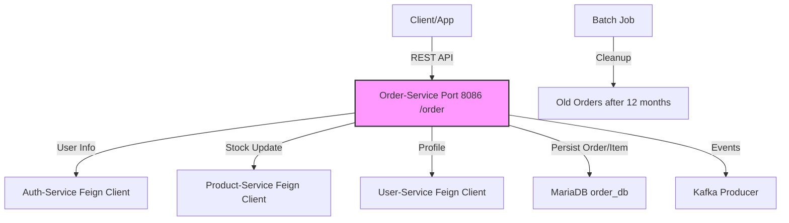

# Order-Service - Quản Lý Đơn Hàng & Thống Kê

[](https://github.com/shopping-ecommerce/order-service/actions) [](https://codecov.io/gh/shopping-ecommerce/order-service) [](LICENSE) [](https://spring.io/projects/spring-boot) [](https://openjdk.org/)

## 📋 Mô Tả
Order-Service là một microservice backend quản lý đơn hàng, cập nhật trạng thái, và thống kê cho ứng dụng e-commerce. Xây dựng bằng **Spring Boot 3.x**, sử dụng **MariaDB** làm database chính (order_db), **Kafka** cho event publishing (OrderCreatedEvent, OrderStatusChangedEvent), và **Feign** để gọi các service khác (Auth cho user info, Product cho stock, User cho profile). Service hỗ trợ tạo/hủy/cập nhật orders (với items, amounts, addresses), query by user/seller/ID/status, và thống kê (seller/admin, theo date range mặc định 30 ngày).

Dự án tập trung vào tính nhất quán (transactional batch delete), bảo mật (JWT cho tất cả endpoints), và maintainability (cleanup cũ sau 12 tháng, chỉ chạy Thứ Hai đầu tháng).

### 🏗️ Architecture
Kiến trúc microservices với Order-Service làm core cho order lifecycle. Các thành phần chính:
- **Communication**: REST API, Feign clients (Auth, Product, User), Kafka producer (events như OrderCreatedEvent).
- **Database**: MariaDB (JPA/Hibernate, entities: Order, OrderItem).
- **Security**: JWT (OAuth2 Resource Server), method security (@PreAuthorize cho stats).
- **Deployment**: Docker + Kubernetes (giả định), port 8086 (context-path: /order).


## ✨ Tính Năng Chính
- **Order Management**: Tạo order (với items, subtotal/shipping/discount/total), update by seller, cancel by user (reason), get by ID/user/seller (filter statuses).
- **Statistics**: Thống kê cho seller (by sellerId, date range), admin (platform-wide: total revenue, orders count, etc.), default 30 ngày gần nhất.
- **Event Publishing**: Kafka events cho created/status changed (bao gồm items payload, voucher, reason).
- **Batch Processing**: Cleanup orders cũ (sau 12 tháng, chỉ Thứ Hai đầu tháng: delete options/items/orders theo batch).
- **Integration**: Feign cho Auth (getMyInfo/getUserById), User (getUserById/searchSeller), Product (nếu cần stock check).
- **Error Handling**: Standardized ApiResponse, JWT entry point cho unauthorized.

## 🛠️ Tech Stack
| Component          | Technology                  | Details                                      |
|--------------------|-----------------------------|----------------------------------------------|
| **Language/Framework** | Java 17+ / Spring Boot 3.x | REST Controllers, JPA, Security              |
| **Database**       | MariaDB                     | order_db (Order, OrderItem entities, options map) |
| **Messaging**      | Apache Kafka                | Producer: JsonSerializer; Events: OrderCreatedEvent, OrderStatusChangedEvent (with OrderItemPayload) |
| **Security**       | Spring Security (OAuth2)    | JWT converter (roles/scopes), @PreAuthorize (SELLER/ADMIN for stats) |
| **Client**         | OpenFeign                   | AuthClient, UserClient; timeout 30-60s       |
| **Batch/Scheduling** | Spring Scheduler           | OrderCleanBatchJob (cron: Thứ Hai 2h, batch 100, months:12) |
| **Utils**          | Lombok, Jackson             | DTOs (events with BigDecimal, LocalDateTime, List items), TemporalAdjusters |

## 🚀 Cài Đặt & Chạy
### Yêu Cầu
- Java 17+ / Maven 3.6+.
- Docker (cho MariaDB, Kafka).
- Environment vars: `DBMS_CONNECTION` (jdbc:mariadb://mariadb:3306/order_db), `FEIGN_AUTH` (http://auth-service:8080), `FEIGN_PRODUCT` (http://product-service:8083/product), `FEIGN_USER` (http://user-service:8082/info) (xem application.yml).

### Bước 1: Clone Repo
```bash
git clone https://github.com/shopping-ecommerce/order-service.git
cd order-service
```

### Bước 2: Setup Môi Trường
```bash
# Copy env files (nếu có example)
cp src/main/resources/application.yml.example application.yml

# Build project
mvn clean install

# Setup Docker services (MariaDB, Kafka)
docker-compose up -d  # Sử dụng docker-compose.yml nếu có
```

### Bước 3: Chạy Service
```bash
# Run với Maven
mvn spring-boot:run

# Hoặc JAR
java -jar target/order-service-*.jar
```

- Port mặc định: **8086** (context: /order, e.g., http://localhost:8086/order/createOrder).
- Test endpoints: Sử dụng Postman/Swagger (http://localhost:8086/order/swagger-ui.html nếu enable). Tất cả cần JWT auth.

Ví dụ test create order:
```bash
curl -X POST http://localhost:8086/order/createOrder \
  -H "Authorization: Bearer <jwt-token>" \
  -H "Content-Type: application/json" \
  -d '{"userId":"user123","items":[...]}'
```

### Bước 4: Test & Debug
```bash
# Run tests
mvn test

# Check logs (DEBUG cho Feign/services)
tail -f logs/application.log  # Hoặc console (pattern: %d{yyyy-MM-dd HH:mm:ss}...)
```

- Cleanup: Chạy cron Thứ Hai đầu tháng 2h (config: order.cleanup.cron).
- Stats: Default date range 30 ngày; filter statuses cho get orders.

## 📚 Tài Liệu
- **API Docs**: Sử dụng SpringDoc OpenAPI (Swagger UI tại `/swagger-ui.html`).
- **Endpoints** (base: /order):
  | Method | Endpoint                          | Description                  | Auth Required    |
  |--------|-----------------------------------|------------------------------|------------------|
  | POST   | `/createOrder`                    | Tạo order                    | Yes              |
  | POST   | `/updateOrder`                    | Update by seller             | Yes              |
  | POST   | `/cancelOrder`                    | Cancel by user               | Yes              |
  | GET    | `/{orderId}`                      | Get order by ID              | Yes              |
  | GET    | `/user/{userId}`                  | Get orders by user (statuses?)| Yes             |
  | GET    | `/seller/{sellerId}`              | Get orders by seller (statuses?)| Yes          |
  | GET    | `/order-statistics/seller/{sellerId}` | Seller stats (date range)  | Yes (SELLER/ADMIN)|
  | GET    | `/order-statistics/admin`         | Admin stats (date range)     | Yes (ADMIN)      |
- **Deployment Guide**: Xem `docs/deploy.md` (Kubernetes manifests cho microservices).
- **Contributing Guide**: Xem `CONTRIBUTING.md`.

## 🤝 Đóng Góp
- Tuân thủ code style: Checkstyle, Lombok annotations.
- Test coverage >80% trước merge.
  Pull requests welcome! Báo issue nếu bug hoặc feature request.

## 📄 Giấy Phép
Dự án này được phân phối dưới giấy phép MIT. Xem file [LICENSE](LICENSE) để biết chi tiết.

## 👥 Liên Hệ
- Author: [Hồ Huỳnh Hoài Thịnh] ([@github-hohuynhhoaithinh](https://github.com/hohuynhhoaithinh))
- Email: [hohuynhhoaithinh@gmail.com]

---

*Cảm ơn bạn đã sử dụng Order-Service! 🚀*